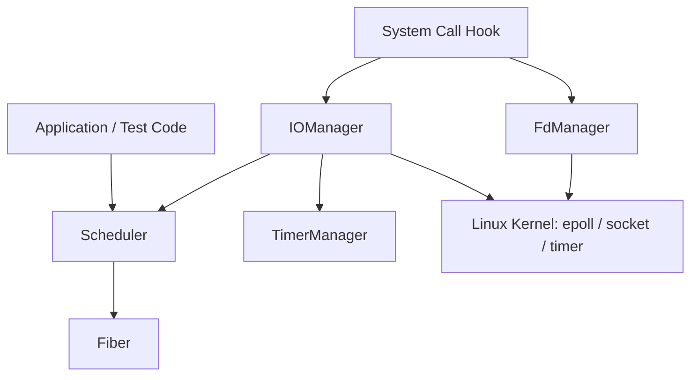

# my_coroutine

C++23 で実装した、Linux 向けのユーザレベル協調型コルーチンライブラリです。  
`ucontext` によるコンテキスト切替、マルチスレッドスケジューラ、`epoll` ベースの I/O イベント管理、タイマー管理、システムコール hook を組み合わせ、同期的に見えるコードを協調的に実行できるランタイムを目指しています。

このプロジェクトは、単なる API 利用ではなく、OS・スレッド・イベント駆動・非同期 I/O の仕組みを自分で分解して理解することを目的として作成しました。

## 特徴

- `ucontext` を利用したユーザレベル Fiber の作成・切替・再利用
- `std::thread` をラップしたスレッド管理と thread local な実行コンテキスト管理
- Fiber / callback を同一キューで扱う N:M 型スケジューラ
- `epoll` と pipe による I/O 待機、wake up、イベント通知
- `std::set` を利用したタイマー管理と recurring timer のサポート
- `dlsym(RTLD_NEXT, ...)` による `sleep/read/write/connect/accept` などの hook
- socket fd の状態、ユーザ指定 non-blocking、送受信 timeout を管理する `FdManager`

## 技術スタック

| 分類       | 内容                                                                            |
| ---------- | ------------------------------------------------------------------------------- |
| 言語       | C++23                                                                           |
| 対象 OS    | Linux                                                                           |
| ビルド     | CMake                                                                           |
| 並行処理   | `std::thread`, `thread_local`, `std::mutex`, `std::shared_mutex`, `std::atomic` |
| コルーチン | `ucontext.h`                                                                    |
| I/O 多重化 | `epoll`, `pipe`, non-blocking socket                                            |
| hook       | `dlsym`, `RTLD_NEXT`                                                            |

## アーキテクチャ



## モジュール構成

```text
include/
  fiber.h          Fiber の状態管理、コンテキスト切替 API
  thread.h         スレッド生成、join、thread local 情報管理
  scheduler.h      Fiber / callback のタスクスケジューラ
  ioscheduler.h    epoll ベースの I/O スケジューラ
  timer.h          タイマーと TimerManager
  hook.h           hook 対象システムコールの宣言
  fd_manager.h     fd 状態管理

src/
  fiber/           Fiber 実装と単体確認コード
  thread/          Thread 実装と単体確認コード
  scheduler/       Scheduler 実装と確認コード
  ioscheduler/     IOManager 実装と確認コード
  timer/           TimerManager 実装と確認コード
  hook/            hook / FdManager 実装と確認コード
```

## 主要設計

### Fiber

`Fiber` は、ユーザレベルで実行コンテキストを切り替える最小単位です。  
各 Fiber は独立したスタック、`ucontext_t`、実行関数、状態を保持します。

主な状態は以下です。

| 状態      | 意味     |
| --------- | -------- |
| `READY`   | 実行待ち |
| `RUNNING` | 実行中   |
| `TERM`    | 実行完了 |

`resume()` で Fiber に制御を移し、`yield()` でスケジューラまたはメイン Fiber に制御を返します。

### Scheduler

`Scheduler` は Fiber と callback を統一的に扱うタスクキューを持ち、複数スレッド上で協調的にタスクを実行します。  
`use_caller` により、呼び出し元スレッドをワーカースレッドとして参加させるかどうかを選択できます。

設計上のポイント:

- タスクは `Fiber` または `std::function<void()>` として登録可能
- 特定 thread id へのタスク割り当てに対応
- idle Fiber により、タスクがない場合もスケジューラの終了条件を継続監視
- `std::atomic` により active / idle thread 数を管理

### IOManager

`IOManager` は `Scheduler` と `TimerManager` を継承し、I/O イベントとタイマーを同じ実行モデルで扱います。  
内部では `epoll` を利用し、イベント発生時に対応する Fiber または callback をスケジューラへ戻します。

対応イベント:

| Event   | epoll      |
| ------- | ---------- |
| `READ`  | `EPOLLIN`  |
| `WRITE` | `EPOLLOUT` |

また、pipe を wake up 用 fd として `epoll` に登録し、別スレッドからのタスク追加やタイマー更新をスケジューラに通知します。

### TimerManager

`TimerManager` は次回実行時刻をキーに `std::set` でタイマーを管理します。  
最短タイマーを素早く取得し、期限切れ callback をまとめて取り出す構造です。

対応機能:

- one-shot timer
- recurring timer
- timer cancel
- timer refresh
- timer reset
- weak pointer による条件付き timer
- システム時刻の巻き戻り検出

### Hook

hook 機構では、`sleep` や socket I/O などのブロッキング API を差し替えます。  
hook が有効なスレッドでは、ブロッキングが発生した場合に Fiber を `yield()` し、I/O イベントまたは timer によって再度スケジューリングします。

主な hook 対象:

- `sleep`, `usleep`, `nanosleep`
- `socket`, `connect`, `accept`
- `read`, `readv`, `recv`, `recvfrom`, `recvmsg`
- `write`, `writev`, `send`, `sendto`, `sendmsg`
- `close`
- `fcntl`, `ioctl`
- `getsockopt`, `setsockopt`

## ビルド方法

このプロジェクトは Linux 環境を前提としています。  
Windows で確認する場合は WSL2 などの Linux 互換環境を推奨します。

```bash
cmake -S . -B build
cmake --build build
```

現在の `CMakeLists.txt` では、確認用ターゲットとして `test_fiber` を生成します。

```bash
./build/test_fiber
```


## Demo

`demo_http_server` は、`Fiber`、`Scheduler`、`IOManager`、`epoll` の連携を確認するための小さな HTTP server です。  
8080 port で接続を待ち受け、request ごとに実行 thread id と runtime の説明を返します。

```bash
./build/demo_http_server
```

別ターミナルから以下を実行します。

```bash
curl http://127.0.0.1:8080/
```

期待される結果:

```text
my_coroutine demo server
request_id: 1
worker_thread_id: 12345
runtime: Fiber + Scheduler + IOManager(epoll)
request_line: GET / HTTP/1.1
```

この demo では、listen socket を non-blocking に設定し、`IOManager::addEvent()` で READ / WRITE event を登録します。  
`epoll` でイベントが発火すると callback が scheduler に戻され、worker thread 上で HTTP response を生成します。


## 動作確認コード

各モジュール配下に確認用の `test.cc` を配置しています。

| ファイル                  | 確認内容                                |
| ------------------------- | --------------------------------------- |
| `src/fiber/test.cc`       | Fiber の作成、resume、コンテキスト切替  |
| `src/thread/test.cc`      | Thread ラッパー、thread local 情報      |
| `src/scheduler/test.cc`   | 複数スレッドでの Fiber スケジューリング |
| `src/timer/test.cc`       | one-shot / recurring timer              |
| `src/ioscheduler/test.cc` | epoll の READ / WRITE イベント          |
| `src/hook/test.cc`        | non-blocking socket と IOManager の連携 |

## 実装で意識した点

- OS のブロッキング API をそのまま使うのではなく、Fiber の待機・再開に変換すること
- スレッド、Fiber、Scheduler の責務を分離し、実行コンテキストの所有関係を明確にすること
- `epoll` のイベント発生と Timer の期限切れを同じスケジューリング経路へ集約すること
- fd ごとにシステム側 non-blocking とユーザ側 non-blocking を分けて管理すること
- 面接時に説明しやすいよう、Fiber から I/O hook まで段階的に機能を拡張できる構成にすること

## 現在の制限と今後の改善

現時点では学習・検証用の実装であり、本番利用を前提としたライブラリではありません。  
今後は以下を改善したいと考えています。

- CMake の test target を全モジュール分に整理
- `CMAKE_COMPILE_WARNING_AS_ERROR` 有効時の警告解消
- hook 有効化の責務整理
- ログ出力の統一と debug flag の整理
- 単体テストフレームワークの導入
- CI による Linux ビルド確認
- `ucontext` 非推奨環境を考慮した実装方式の検討
  
  [x] ブランチでboost::fcontextを使用したucontext構造体の置き換えが完了しました
- コールバック関数とパラメータバインディングには、引き続き C++11 の `std::bind` を使用します。
  
  [ ] 今後のバージョンでは、C++14 のラムダ式とキャプチャの初期化を使用する方式に移行します。