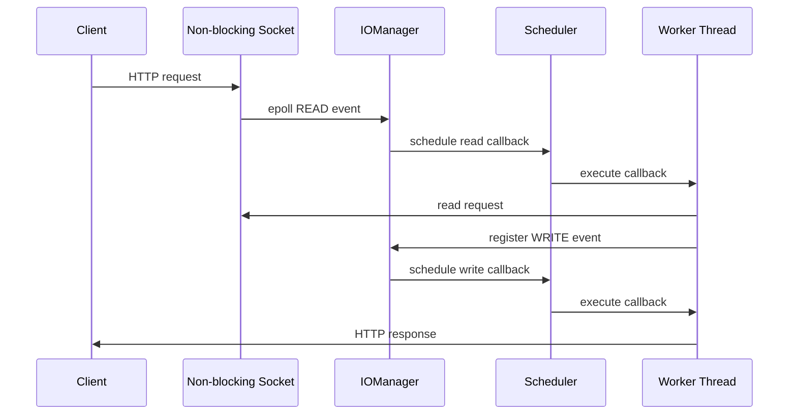

# 使用手順書

本書は、`my_coroutine` のビルド、実行、動作確認を行うための手順書です。  
README はプロジェクト全体の説明、本書は実際に動かすためのオペレーション手順として位置付けています。

## 目的

この手順では、以下を確認します。

- コアライブラリ `mcoroutine` がビルドできること
- `Fiber`、`Scheduler`、`IOManager`、`epoll` の連携を `demo_http_server` で確認できること
- 各 module 配下の `test.cc` を、必要に応じて確認用 target として有効化できること
- 面接時に、実装内容と実行結果を短時間で説明できること

## 前提条件

本プロジェクトは Linux 環境を前提としています。

| 項目 | 内容 |
| --- | --- |
| OS | Linux |
| コンパイラ | C++23 対応の `g++` または `clang++` |
| ビルドツール | CMake 3.31 以上 |
| 必要な Linux API | `ucontext`, `epoll`, `dlsym`, socket API |

Windows 環境で確認する場合は、WSL2 上の Linux distribution を利用してください。  
PowerShell や Windows native compiler では、`epoll` などの Linux 固有 API が利用できないため、そのままではビルドできません。

## ディレクトリ構成

```text
.
├── include/                 Public headers
├── src/                     Library implementation and module tests
├── examples/                Demo applications
│   └── demo_http_server.cc  Runtime demo server
├── docs/                    Usage and design documents
├── CMakeLists.txt
└── README.md
```

## ビルド手順

プロジェクトルートで以下を実行します。

```bash
cmake -S . -B build
cmake --build build
```

ビルドが成功すると、主に以下の target が生成されます。

| target | 目的 |
| --- | --- |
| `mcoroutine` | コア静的ライブラリ |
| `demo_http_server` | 全体動作確認用 HTTP server |

各 module の確認コードは `src/*/test.cc` に配置しています。  
必要に応じて `CMakeLists.txt` で個別 target を有効化し、Fiber、Scheduler、Timer などを単体で確認できます。

## Demo HTTP Server の起動

`demo_http_server` は、プロジェクト全体の動作を説明するための demo です。  
内部では non-blocking socket を作成し、`IOManager::addEvent()` で READ / WRITE event を登録します。

```bash
./build/demo_http_server
```

起動後、以下のようなメッセージが表示されます。

```text
my_coroutine demo server listening on http://127.0.0.1:8080
try: curl http://127.0.0.1:8080/
press Ctrl+C to stop
```

別ターミナルから以下を実行します。

```bash
curl http://127.0.0.1:8080/
```

期待されるレスポンス例:

```text
my_coroutine demo server
request_id: 1
worker_thread_id: 12345
runtime: Fiber + Scheduler + IOManager(epoll)
request_line: GET / HTTP/1.1
```

停止する場合は、server を起動したターミナルで `Ctrl+C` を押します。

## Demo で確認できる実行フロー



説明時のポイント:

- socket は non-blocking に設定されている
- `epoll` が READ / WRITE event を検知する
- event 発火後、callback が scheduler に戻される
- worker thread 上で callback が実行される
- 同期的に見える処理を、イベント駆動で分割して実行している
